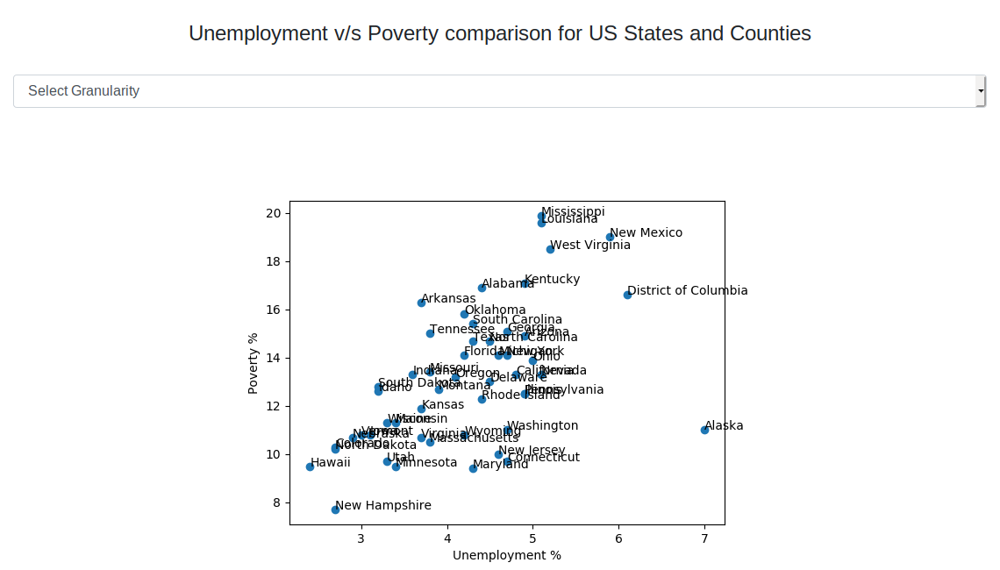
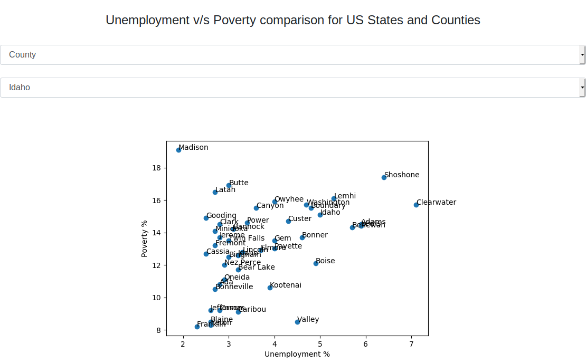

# Udacity Data Engineering Nano Degree Final Project
This repository contains my Final Project for Udacity Data Engineering Nano Degree.


## Scope of the project
<p>The scope of this project is to utilize the data sources mentioned above and correlate the two data sources.
We shall be able to see how unemployement and poverty correlate with each other in all the US states and counties. 
The data sets used for this analysis are of the year 2017.
</p>
<p>The project also contains a small web app that enables the users to navigate through the data of all the counties and
look at the correlation on a scatter graph.
</p>
<p>
 The project uses pandas for data ingestion, AWS RDS postgres for data storage, AWS S3 buckets that has the file sto load.
It also uses flask to render the webpage and matplotlib to plot scatter graphs.
</p>

## Data Source
The Data Source selected for this project comes from [this](https://www.ers.usda.gov/data-products/county-level-data-sets/) link.
The 2 data sources selected for this project are:
1. **Poverty**
    <p>This dataset gives the data of people below the poverty line in the US state counties</p>

2. **Unemployment**
    <p>This dataset gives the data of unemployement in the US state counties</p>


## Data Modeling
Following are the fact and dimension tables created:
### Dimension Table
```
dim_county
    columns: fips_id, name, state
```

### Fact Tables
```
fact_poverty
    columns: id, fips_id, year, percentage
fact_unemployement
    columns: id, fips_id, year, percentage
```

### Project Setup
Following steps demonstrate how to set up the project:
* Update `credentials.cfg` to include credentials for postgres and AWS and bucket name where the files are present
* Create virtualenv by running `virtualenv venv -p python3`
* Activate the virtualenv `source venv/bin/activate`
* Install project requirement `pip install -r requirements.txt`
* Run `python create_tables.py` to create tables in the postgres database
* Run `python etl.py` to read the files and populate them into dimension and fact tables
* Run `python app.py` to run the flask application that will plot catter graphs to correlate poverty and unemployment data for 
US States and Counties.

### Screenshots
#### Data for US States

#### Example Data for Counties of a US State


### Other Scenarios
* If the data is increased e.g. we have files for the whole last century and not only for the year 2017,
 we can use spark to read and plot the graphs for a year at run time without storing the data in postgres. 
* We can use airflow to schedule etl.py for data ingestion when the new file is available
* We can deploy a bigger instance of postgres database if the data is being queried by more people.
We can also cache some sparsely changing data in memory to minimize the database querying.